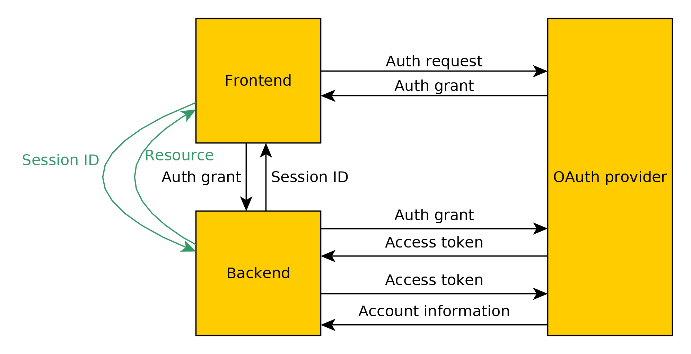

Authentication system
=====================

The authentication is provided by several SSOs (such as Google or Fitbit) through the OpenID protocol.

Behavior
--------



The client must get its authentication grant and access token with the OAuth provider.

To access a backend resource which requires authentication, the client must provide an access token as well as the name of the SSO provider.  
The backend then independently checks the validity of the access token and retrieves user information.

If the account does not yet exist in the database, it is automatically created.

Key settings
------------

You should fill your client ID and secret keys in the `rebblestore-api.json` file.

API
---

### `/user/login`

Create a user session tied to the provided authentication code (once the access token expires, so does the session).

Query:
```JSON
{
    "code": "<authorization code>",
    "authProvider": "<OpenID provider>"
}
```

Response:
```JSON
{
    "sessionKey": "<session key>",
	"success": boolean,
	"errorMessage": "<error message>"
}
```

### `/user/info`

Request information about the user.

Query:
```JSON
{
    "sessionKey": "<session key>",
}
```

Response:
```JSON
{
    "loggedIn": boolean,
    "name": "<name>"
}
```
If the user is not logged in (the session key is invalid or the associated access token has been invalidated), name will be blank.

### `/user/update/name`

Change the logged in user's name. Empty field is allowed.

Query:
```JSON
{
    "sessionKey": "<session key>",
    "name": "<Name>"
}
```

Response:
```JSON
{
	"success": boolean,
	"errorMessage": "<error message>"
}
```

SQL Structure
-------------

```SQL
create table users (
    id integer not null primary key,
    provider text not null,
    sub text not null,
    name text not null,
    type text nont null default 'user',
    pebbleMirror integer not null,
    disabled integer not null
);

create table userSessions (
    sessionKey text not null primary key,
    userId integer not null,
    access_token text not null,
    expires integer not null
);

create table userLogins (
    id integer not null primary key,
    userId integer not null,
    remoteIp text not null,
    time integer not null,
    success integer not null
);
```

* `users` contains the user account information;
* `userSessions` contains all active session (*however, an active session is not necessarily a valid session; the access_token might be invalid);
* `userLogins` contains a log of all user logins for administrative purposes.